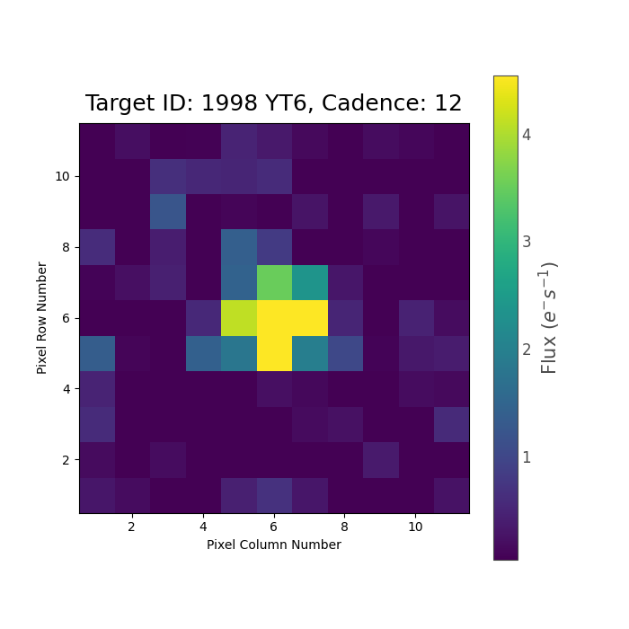

[](https://github.com/altuson/tess-asteroids/actions/workflows/test.yml)
[](https://github.com/altuson/tess-asteroids/actions/workflows/mypy.yml/)
[](https://github.com/altuson/tess-asteroids/actions/workflows/ruff.yml)

# tess-asteroids

`tess-asteroids` allows you to make TPFs and LCs for any object that moves through the TESS field of view, for example solar system asteroids, comets or minor planets.

## Example use

### Making a TPF

You can create a TPF that tracks a moving object by providing an ephemeris, as follows:

```python
import numpy as np
import pandas as pd
from tess_asteroids import MovingTargetTPF

# Create an artificial ephemeris
time = np.linspace(1790.5, 1795.5, 100)
ephem = pd.DataFrame({
            "time": time,
            "sector": np.full(len(time), 18),
            "camera": np.full(len(time), 3),
            "ccd": np.full(len(time), 2),
            "column": np.linspace(500, 600, len(time)),
            "row": np.linspace(1000, 900, len(time)),
        })

# Initialise
target = MovingTargetTPF("example", ephem)

# Make TPF and save to file
target.make_tpf()

```

This will create a SPOC-like TPF, centred on the moving object, and it will save this TPF as a fits file. A few things to note about the format of the ephemeris:
- `time` must have units BTJD = BJD - 2457000.
- `sector`, `camera`, `ccd` must each have one unique value.
- `column`, `row` must be one-indexed, where the lower left pixel of the FFI has value (1,1).

There are a few optional parameters in the `make_tpf()` function. This includes:
- `shape` controls the shape of the TPF. Default : (11,11).
- `file_name` is the name the TPF will be saved with. If one is not given, a default name will be generated. In the above example, the default name was `tess-example-s0018-shape11x11-moving_tp.fits`.
- `save_loc` is the directory where the TPF will be saved. Note, the directory is not automatically created.

These settings can be changed as follows:

```python
# Make TPF and save to file - changed default settings
target.make_tpf(shape=(20,10), file_name="test.fits", save_loc="movingTPF")
```

Instead of inputting an ephemeris, you can also create a TPF using the name of an object from the JPL/Horizons database and the TESS sector. This will use `tess-ephem` to compute the ephemeris for you.

```python
# Initialise for asteroid 1998 YT6 from TESS sector 6.
target, ephem = MovingTargetTPF.from_name("1998 YT6", sector=6)

# Make TPF and save to file (tess-1998YT6-s0006-shape11x11-moving_tp.fits)
target.make_tpf()
```

### Plotting the TPF with `lightkurve`

The TPFs that get created by `tess-asteroids` can be plotted using `lightkurve`, as follows:

```python
import lightkurve as lk
import matplotlib.pyplot as plt

tpf = lk.read("tess-1998YT6-s0006-shape11x11-moving_tp.fits")
fig, ax = plt.subplots(1, figsize=(7,7))
tpf.plot(ax=ax, frame=10, title='Target ID: 1998 YT6, Cadence: 12')
plt.show()

# If you're in a Jupyter notebook, you can also animate the TPF.
tpf.animate()
```




