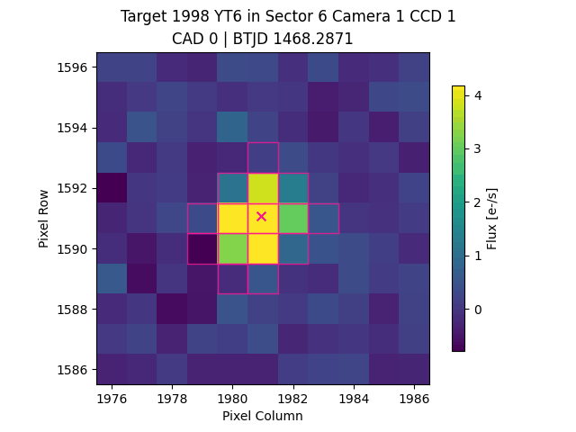

[](https://github.com/altuson/tess-asteroids/actions/workflows/test.yml)
[](https://github.com/altuson/tess-asteroids/actions/workflows/mypy.yml/)
[](https://github.com/altuson/tess-asteroids/actions/workflows/ruff.yml)

# tess-asteroids

`tess-asteroids` allows you to make TPFs and LCs for any object that moves through the TESS field of view, for example solar system asteroids, comets or minor planets.

## Example use

### Making a TPF

You can create a TPF that tracks a moving object by providing an ephemeris, as follows:

```python
import numpy as np
import pandas as pd
from tess_asteroids import MovingTPF

# Create an artificial ephemeris
time = np.linspace(1790.5, 1795.5, 100)
ephem = pd.DataFrame({
            "time": time,
            "sector": np.full(len(time), 18),
            "camera": np.full(len(time), 3),
            "ccd": np.full(len(time), 2),
            "column": np.linspace(500, 600, len(time)),
            "row": np.linspace(1000, 900, len(time)),
        })

# Initialise
target = MovingTPF("example", ephem)

# Make TPF and save to file
target.make_tpf()

```

The `make_tpf()` function is retrieving and reshaping the FFI data, performing a background correction, computing the aperture and saving a SPOC-like TPF as a fits file. A few things to note about the format of the ephemeris:
- `time` must have units BTJD = BJD - 2457000.
- `sector`, `camera`, `ccd` must each have one unique value.
- `column`, `row` must be one-indexed, where the lower left pixel of the FFI has value (1,1).

There are a few optional parameters in the `make_tpf()` function. This includes:
- `shape` controls the shape of the TPF. Default : (11,11).
- `file_name` is the name the TPF will be saved with. If one is not given, a default name will be generated. In the above example, the default name was `tess-example-s0018-3-2-shape11x11-moving_tp.fits`.
- `save_loc` is the directory where the TPF will be saved. Note, the directory is not automatically created.

These settings can be changed as follows:

```python
# Make TPF and save to file - changed default settings
target.make_tpf(shape=(20,10), file_name="test.fits", save_loc="movingTPF")
```

Instead of inputting an ephemeris, you can also create a TPF using the name of an object from the JPL/Horizons database and the TESS sector. This will use `tess-ephem` to compute the ephemeris for you.

```python
# Initialise for asteroid 1998 YT6 from TESS sector 6.
target, ephem = MovingTPF.from_name("1998 YT6", sector=6)

# Make TPF and save to file (tess-1998YT6-s0006-1-1-shape11x11-moving_tp.fits)
target.make_tpf()
```

### Understanding the TPF

The TPF has four HDUs: 
- "PRIMARY" - a primary HDU containing only a header.
- "PIXELS" - a table with the same columns as a SPOC TPF. Note that "POS_CORR1" and "POS_CORR2" are defined as the offset between the center of the TPF and the expected position of the moving object given the input ephemeris.
- "APERTURE" - an image HDU containing the average aperture across all times.
- "EXTRAS" - a table HDU containing columns not found in a SPOC TPF. This includes "CORNER1"/"CORNER2" (original FFI column/row of the lower-left pixel in the TPF), "PIXEL_QUALITY" (3D pixel quality mask identifying e.g. strap columns, non-science pixels and saturation) and "APERTURE" (aperture as a function of time).

### Plotting the TPF with `lightkurve`

The TPFs that get created by `tess-asteroids` can be plotted using `lightkurve`, as follows:

```python
import lightkurve as lk
import matplotlib.pyplot as plt

# Read in TPF without removing bad cadences
tpf = lk.read("tess-1998YT6-s0006-1-1-shape11x11-moving_tp.fits", quality_bitmask="none")

# Plot TPF and aperture for a single frame
aperture_mask = tpf.hdu[3].data["APERTURE"][200]
fig, ax = plt.subplots(1, figsize=(7,7))
tpf.plot(ax=ax, aperture_mask=aperture_mask, frame=200, title="Target: 1998 YT6")
plt.show()

# You can also animate the TPF and save as a gif.
fig, ax = plt.subplots(1, figsize=(7,7))
tpf._to_matplotlib_animation(ax=ax).save("tess-1998YT6-s0006-1-1-shape11x11-moving_tp.gif", writer="pillow")
```




